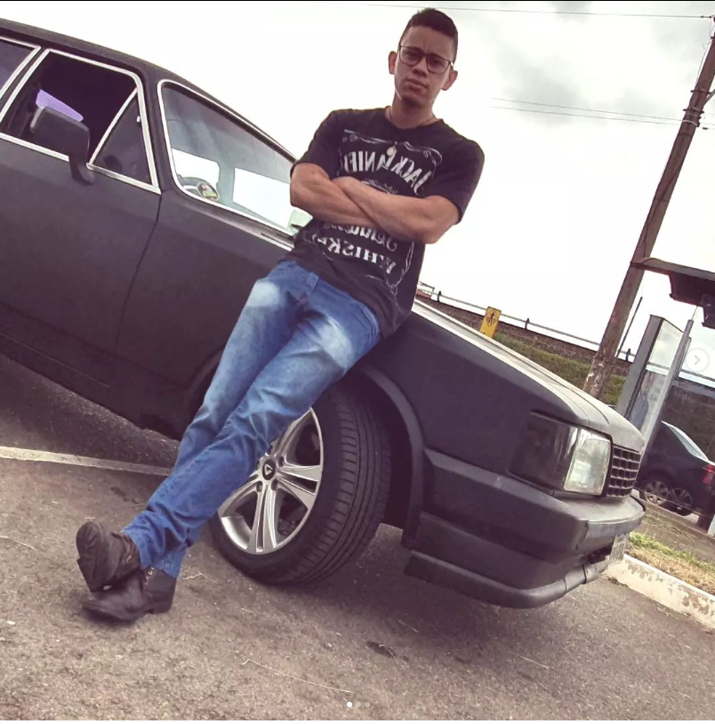
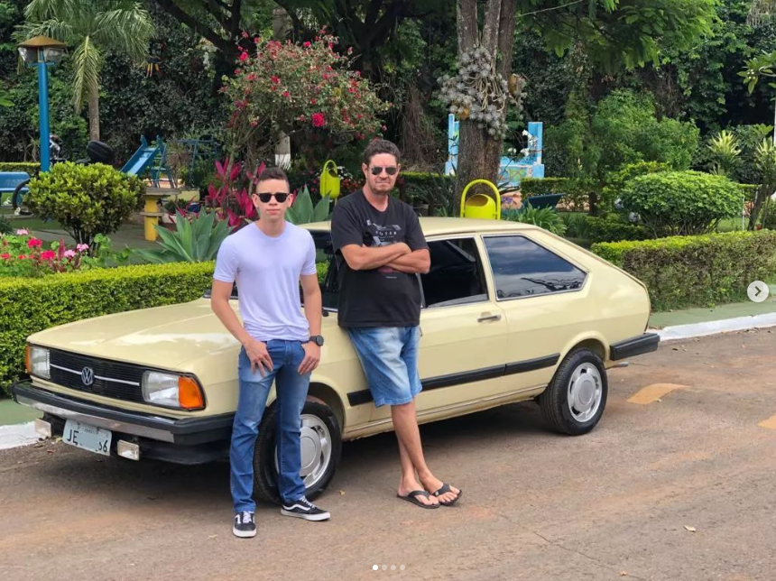
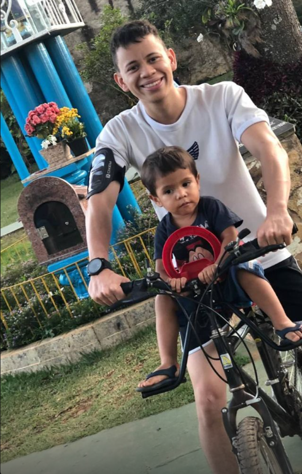

## 1- Quem sou eu?
Sou Lucas Ramon futuro engenheiro de software e estudante da Universidade de Brasília.

## 2- Como ingressei na Universidade?

Ingressei na Universidade em junho de 2018 pelo vestibular tradicional enquanto estava cursando o 3 ano do ensino médio. Com o apelo na justiça, consegui fazer parte do time de estudantes de Engenharia de Software da FGA-UnB.

## 3- Hobbies e Curiosidades sobre mim
### 3.1 Automóveis
Sou apaixonado por carros, motocicletas e bicicletas. Gosto de dirigir o Opala 1989 do meu tio e o Passat LS do meu outro tio, minha família é bem engajada no negócio. Fazemos manutenção e consertos nos veículos da família para distração, é uma forma de aproveitar a companhia da parentada e de compartilhar o nosso amor por automóveis.Já a paixão por motocicletas herdei do meu irmão mais velho e sempre que posso enrolo o cabo do acelerador, mas durante a pandemia foi a bicicleta que ganhou espaço no meu coração.
<table>
<tr>
<td align="center">
 
  </td>
<td align="center">
  
  </td>
  <td align="center">
   
  </td>
  </table>
  
  ### 3.2-Rock n Roll
  Adoro tocar violão ou guitarra, aprendi assitindo aos vídeos do Cifra Club no Youtube. Iron Maiden, Metallica, Engenheiros do Hawaii, Legião Urbana e Raul Seixas são grupos que me agradam.
  
  ### 3.3 Desenhos
  Desde de guri gosto de desenhar, com o tempo fui pegando o jeito. Quando pessoas próximas fazem aniversário as presenteio com algum desenho emoldurado.
  
